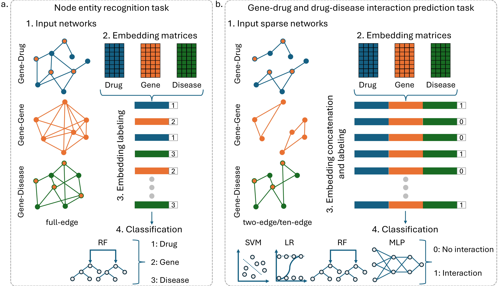

# GDD-BERT

GDD-BERT is an AI model designed to identify drug-gene-disease interactions, aiding drug repositioning. It utilizes BERTwalk, a novel embedding technique based on BERT, to generate vector representations of nodes in biological networks by analyzing complex relationships through random walks. These embeddings are combined into drug-gene-disease triplets, which are used in a classifier to predict potential interactions.

    

This repository contains all the necessary files and code to reproduce the analyses conducted with GDD-BERT.

## Data

Full networks are retrieved from Harmonizome (Accessed 04 April 2024). Gene-chemical and gene-disease networks are available at [Harmonizome CTD](https://maayanlab.cloud/Harmonizome/resource/Comparative+Toxicogenomics+Database), gene-gene networks are available at [Harmonizome Pathway Commons](https://maayanlab.cloud/Harmonizome/resource/Pathway+Commons).

The `data` directory includes both the biological networks and their corresponding embeddings for two-edge and ten-edge configurations. Additionally, the `utils` folder contains the following key files:

- **`drug_list.txt`**: A list of unique drugs used retrieved from **CTD Gene-Drug** network.  
- **`disease_list.txt`**: A list of unique diseases retrieved from **CTD Gene-Disease** network.  
- **`only_train_genes.txt`**: A list of high-similarity genes restricted to the training set.  

## Notebooks
The repository provides Jupyter notebooks to process data and train classifiers:

- **`create_dfs.ipynb`**: Prepares training and validation datasets by combining input networks and their corresponding embeddings.  
- **`MLP_classifier.ipynb`**: Trains a Multi-Layer Perceptron (MLP) classifier on the training set and evaluates its performance on the validation set.  
- **`ML_classifiers.ipynb`**: Trains and evaluates various machine learning classifiers, including Logistic Regression (LR), Support Vector Machines (SVM), and Random Forests (RF).  

## Usage
1. **Prepare the datasets**:  
   Run `create_dfs.ipynb` to process the input networks and embeddings, generating the training and validation datasets.

2. **Train classifiers**:  
   - Use `MLP_classifier.ipynb` to train and evaluate an MLP model.  
   - Alternatively, run `ML_classifiers.ipynb` to train and evaluate other classifiers (LR, SVM, RF).  
